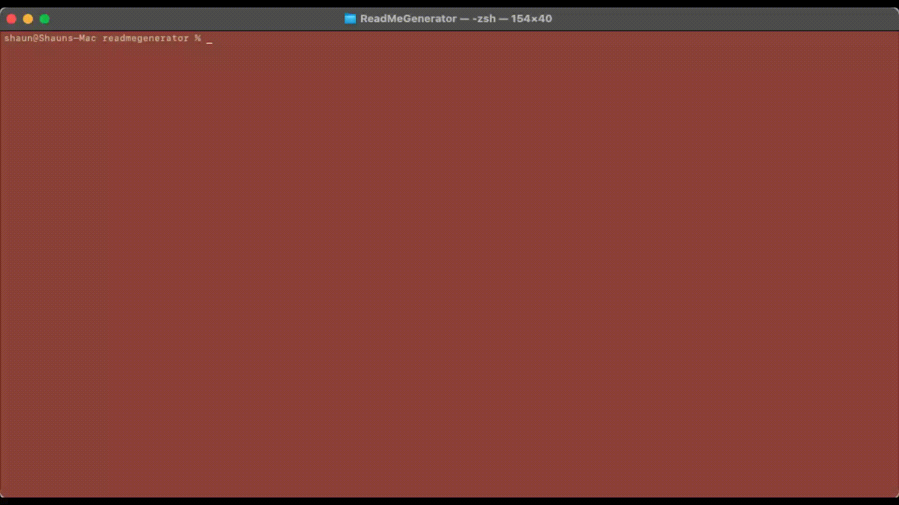

# ReadMeGenerator

## Description
 A node.js application that utilizes the <code>Inquirer package</code>, to take user input and create a markdown formatted ReadMe.

## Table of Contents
- [Installation](#installation)
- [Usage](#usage)
- [Contributing](#contributing)
- [Tests](#tests)
- [Questions](#questions)
## Installation
Simply clone to your local device and run the following command: <code>npm i</code>
## Usage
 To begin generating a new ReadMe, run the following command: <code>node index.js</code> then you will be prompted to begin.
 
## Contributing
 This project is complete. However, if you are interested in adding features, fixing potential bugs, etc. then find my contact information in the Questions section.
## Tests
 The test that is currently available checks to make sure that all of the sections of the ReadMe are present. Start by installing Jest with <code>npm install --save-dev jest</code>, then run the command <code>npm run test</code> to test!
## Questions
If you have any questions about the project or repository, open issue or contact me directly at <code>shaun.tehranchi@gmail.com</code>. Find more of my projects on Github <code>@ST12345678910</code>
 
